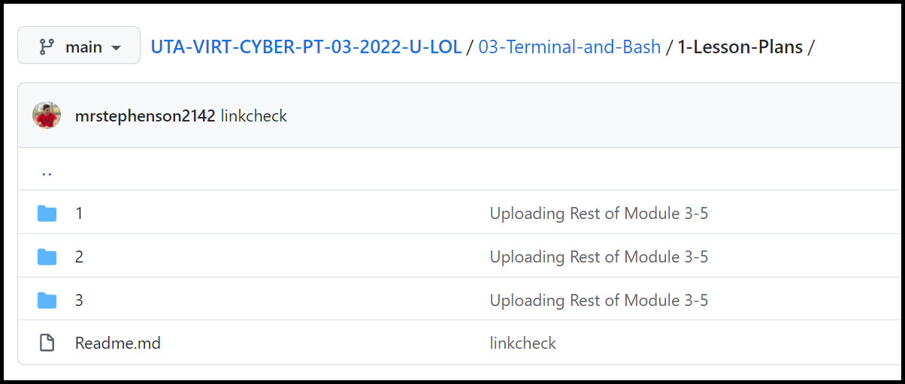
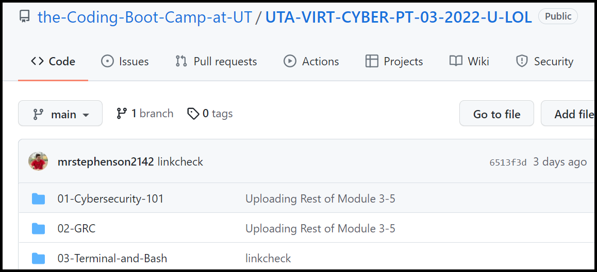
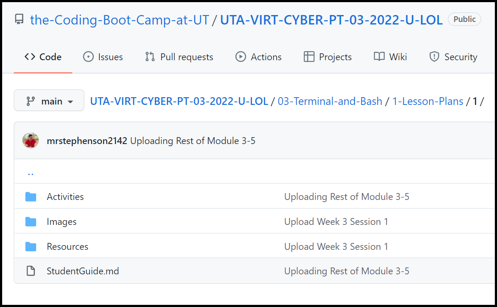
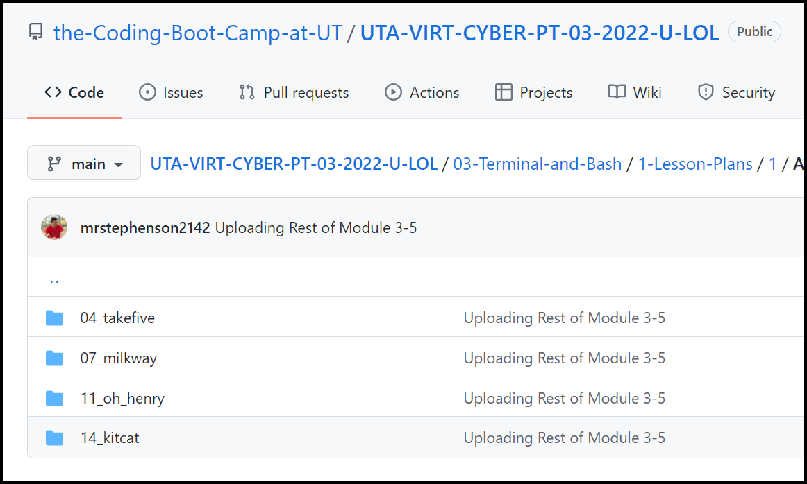
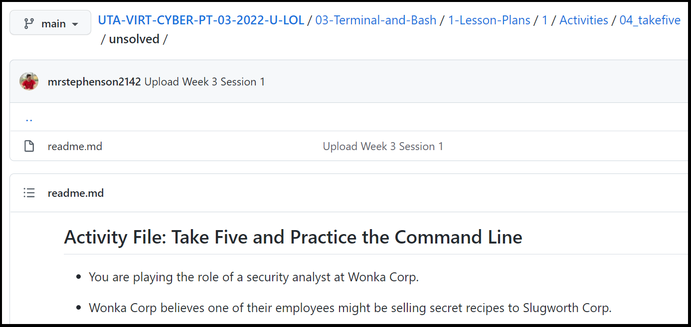

# Class Github Repository

Welcome to the University of Texas Cybersecurity Boot Camp. In this repo, you will find your homework and class lessons. 

**NOTE: for Bootcamp Spot links you may have to log in and select your cohort then click the link in this document again to get to the anticipated location.**

# Class Layout

- The boot camp is made up of 24 modules. ([View Syllabus](https://bootcampspot.com/academicSyllabus))
- Each module consists of three classes. Also, referred to as sessions or lessons. 
- Each module will have homework.
- Homework is assigned during the third lesson of each module and is due the following week. 
    - Homework may not be announced, but exists for every lesson and is available in the same relative location for each module.

# Classroom Tools 

The classroom and curriculum will use four tools to provide the lessons. This list does not include software for connecting to labs as that will be covered during lessons. It would be a good idea to bookmark some of these resources. 

- [Class Github Repository](#class-github-repository)
- [Class Layout](#class-layout)
- [Classroom Tools](#classroom-tools)
  - [Bootcamp Spot](#bootcamp-spot)
  - [GitHub](#github)
    - [Navigation](#navigation)
    - [Root Directory](#root-directory)
    - [Module Directory](#module-directory)
    - [Lessons](#lessons)
    - [Activities](#activities)
    - [Homework](#homework)
  - [Zoom](#zoom)
  - [Slack](#slack)
    - [Quick Start Usage Guide](#quick-start-usage-guide)
    - [Downloads](#downloads)

## Bootcamp Spot

<https://bootcampspot.com/>

You will primarily use Bootcamp Spot to:

- Check-in for attendance each lesson. 
- Turn in homework. 
- View calendar for upcoming lesson and Career Services milestones. 
- Access career services.
- Submit support tickets. 
- Request tutoring. 

For help using Bootcamp Spot, see their video library [here](https://bootcampspot.com/videos).

## GitHub 

The class GitHub is also sometimes referred to as the class repo. Is an online repository filled with all the class lessons, homework, and resources needed throughout the boot camp. 

**Be careful not to confuse GitHub (Web Application) with GitBash (a program downloaded and installed on Windows as part of your pre-work.)

<https://github.com/the-Coding-Boot-Camp-at-UT/UTA-VIRT-CYBER-PT-03-2022-U-LOL>

In the repo you will find:

- Each week's module and lessons. 
- One Student Guide per lesson.
- Activities.
- Homework

### Navigation 

There are a couple of GitHub features you should know before beginning. 

- If a folder contains a README.md file it will automatically be displayed while you are in that folder. 

- If there is a nested series of folders, but there are no files in the intermediate folders, GitHub will automatically put you in a child folder.  

- You can enter a directory by clicking on the folder name.

- You can go back up the directory tree by clicking on the breadcrumb hyperlinks. 
  - In the images below I am in the Resources folder for lesson 3 of the Terminal and Bash Module. 
  - To go navigate back to a listing of all sessions I would click on the **1-Lesson-Plans** hyperlink in the breadcrumb links. 

### Root Directory 

In the repository's root directory you will see a folder with the current week and module name, e.g., **03-Terminal-and-Bash**. The repo may contain future modules as well. Refer to the course calendar or syllabus if you're unsure which week you are on. 

### Module Directory 

- [Lessons](#lessons)
- [Homework](#homework)

Clicking on the name of a module will show you the lesson plans and homework for that module. The homework folder may not be populated until after the third lesson for that module. 

### Lessons 

Click on **1-Lesson-Plans** will take you to a folder with that week's lessons. The folders will be numbered and may contain all the lessons for that module. Refer to the course calendar or syllabus if you're unsure which lesson you are on. 

Clicking on a lesson will show you the content of that day's lesson. 

The folders will typically include, but are not limited to:

- Student Guide
  - A guide that provides valuable information to the student.
  - Follows lecture and summaries concepts.
  - Links to activities and slides shown in class. 
  - Links to activity solutions when available. 
- Activities folder
  - Contains the activities performed in class and linked in the student guide. 
- Resources folder
  - Supporting files or references mentioned in class can sometimes be found here. A student will not usually need to navigate here manually. 
- Images folder
  - Supporting images shown in class can sometimes be found here. A student will not usually need to navigate here manually. 

### Activities

If you click on the Activities folder, you will see a listing of activities, named similarly to what is being discussed in class or after the current scenario. Following the class guide will make sure you are on the correct activity. 

Clicking on an activity name will show you folders with solved and unsolved versions of the activities, or if no solution has been uploaded, to the unsolved version of the activity. 

**Directory Showing Both Solved and Unsolved**

**Unsolved**

### Homework 

In the homework directory, you will find that week's homework and, if they have been uploaded, the solutions. 

## Zoom 

Used for classroom sessions. 

- <https://zoom.us/download>

## Slack

Used for classroom chats and sharing of session resources. 

### Quick Start Usage Guide

- <https://slack.com/help/articles/360059928654-How-to-use-Slack--your-quick-start-guide>

### Downloads

- https://slack.com/downloads/windows
- https://slack.com/help/articles/207677868-Download-Slack-for-Mac
- https://slack.com/downloads/linux